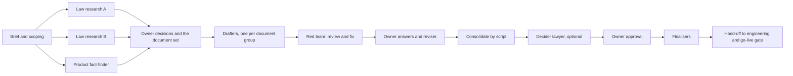

# AI Legal Team

A reusable skill and prompt kit that runs a **team of AI agents** to draft **every legal document your
website, app or SaaS needs**, chosen from what the product really does and where it operates. That means
the usual Terms of Service and Privacy Policy, plus whatever your product calls for: cookies, refunds,
subscriptions, seller terms, listings, community rules, AI notices, app-store disclosures,
business-customer contracts, the short legal texts inside the product, and the internal compliance records
behind them.

What makes it different from "write me a privacy policy":

- **It scopes from the product.** Fifty-one yes/no questions about the product (accounts, payments,
  subscriptions, listings, posts, messages, tracking, AI, apps, business customers, countries) pick the
  documents and review records from a catalogue of 63. A simple app may need six; a marketplace with payments, AI and users
  in several countries may need twenty-five.
- **It checks the product first.** A fact-finder maps what the code really does, with file-and-line
  evidence, so no document claims something the product does not do. Anything not true yet becomes a
  product change.
- **It researches the law from primary sources** for every country in scope, with a confidence level for
  every finding.
- **It argues with itself.** A red team attacks every draft for false claims, contradictions and clauses
  a court would strike, and fixes the clear-cut ones.
- **The owner decides.** Every business choice is put to the owner as one plain question with a
  recommendation. An optional "decider lawyer" proposes answers to every open legal question for the
  owner to confirm.
- **It hands engineering a work list:** every product change the documents depend on, and where each
  document must appear in the product.
- **It is cheap to review.** A script (no AI) builds one review page from the Markdown files.
- **It reviews the software work itself.** Specialists cover code and asset licensing, ownership,
  development contracts/SOWs, vendor exit and handover, app-store/privacy evidence and source verification.
  Reviews stay separate from signing, negotiation and publication.
- **It checks declared evidence.** Release gates require scoped documents, local source snapshots and
  hash-bound owner/counsel/product review records. They cannot authenticate reviewers or establish legal truth.

> **Not legal advice.** Everything this kit produces is a draft prepared by AI systems. Have a qualified
> lawyer in each jurisdiction review the final documents before you publish them.

## Who it is for

Founders, product teams and AI agents (Claude Code, Codex, Cursor, ChatGPT, or anything that can read
files and browse the web) building a website, web app, mobile app, SaaS product, marketplace or online
store. They need legal documents grounded in their actual product and their actual law, and a clear list
of what to ask a real lawyer.

## What you get

Everything is chosen for your product. Nothing is added just to make the pack bigger.

### 1. Public documents, picked from the product's actual scope

| Area | Documents (each one only when your product needs it) |
|---|---|
| Core | Terms of Service · Privacy Policy · Cookie Policy · Acceptable Use Policy |
| Accounts and safety | Account deletion and data requests page · Children's privacy notice · Safety guidelines |
| Money | Payments and refunds · Subscription terms · Fee schedule |
| Selling | Shipping and delivery · Returns and warranty · Product safety information · Booking and cancellation terms · Reviews policy |
| Marketplaces | Business (seller) terms · Prohibited and restricted listings · Buyer protection · Ranking and recommendations notice · Moderation and appeals |
| Content | Community guidelines · Copyright and take-down policy · Trademark policy |
| Marketing and partners | Marketing consent notice · Advertising and disclosure policy · Referral and rewards terms · Gift card terms · Contest rules · Affiliate agreement |
| AI | AI features notice · AI acceptable use policy |
| Mobile apps | End-user licence agreement, and the answers for Apple's App Privacy and Google Play's Data safety forms |
| Business customers and developers | Customer agreement · Data processing agreement · Sub-processor list · Service level agreement · API terms · Security overview · Vulnerability disclosure policy |
| Regulated categories | Consent forms · Consumer health data policy · Candidate privacy notice · Category schedules inside the terms |
| Company notices | Legal notice (imprint) · Accessibility statement · Law-enforcement guidelines · Transparency report |

### 2. The legal words inside your product
The sign-up line for every sign-in method, the cookie banner, the marketing opt-in, the age gate,
permission prompts, AI disclosures, checkout and booking wording, receipts, and the account deletion
confirmation.

### 3. Internal compliance records
Data map and retention schedule, data protection impact assessment, legitimate-interests and transfer
assessments, data request procedure, breach response plan, AI register and online-safety risk assessment,
as your product requires.

### 4. A pack for your lawyer
Questions for counsel (every open point, with where it comes from), the decider's provisional answers,
and a law research summary with sources and confidence levels.

### 5. A pack for your engineers
Every product change the documents depend on, real bugs found along the way as separate tasks, and an
implementation checklist: where each document must appear, what to record (acceptances and consents), and
how to hand the documents to developers and coding agents.

### Software, app and website review modes

Use a focused review without generating every product document:

| Need | Added workflow |
|---|---|
| Software/asset licensing and IP | Version-bound dependency and asset inventory, actual license texts, distribution model, notices and ownership questions |
| Developer, agency or vendor contract | SOW and acceptance, change control, IP, confidentiality, security/data duties, maintenance, source/account control and exit |
| Web/mobile release | SDK/data/permission map, deletion and moderation, store privacy answers, claim evidence and distinct local/native/hosted/store results |
| Citation and product truth | Independent source support, jurisdiction/effective-date checks, file snapshots/hashes, explicit unknown and contradictory claims |

The catalogue adds seven scoped software work products: development agreement, SOW, contributor/IP
agreement, third-party notices, materials register, supply-chain review and contract issue review.
Private agreements, findings and evidence stay internal. No tracked-change DOCX engine or autonomous
legal-service runtime is bundled; this is an agent skill with deterministic Python helpers.

### 6. One review page and a go-live gate
All documents on one page, with open points colour-coded, and a check that fails while anything is still a
draft.

The catalogue, with what triggers each document and what it must contain, is in
[`templates/document-catalogue.md`](templates/document-catalogue.md). The questions that pick the set are
in [`checklists/document-scoping.md`](checklists/document-scoping.md).

## How it works



The full playbook is in [`SKILL.md`](SKILL.md). Each role has its own prompt in [`roles/`](roles/).

## Quick start

**Claude Code.** Copy this folder to `~/.claude/skills/ai-legal-team` (all your projects) or to
`.claude/skills/ai-legal-team` inside a project. Then ask: *"Form an AI legal team for this product"*.

**Other agents.** Give your agent [`SKILL.md`](SKILL.md) as its instructions. Run each role in
[`roles/`](roles/) as a separate agent or chat, passing the filled-in templates from
[`templates/`](templates/).

**By hand.** Follow the phases in `SKILL.md` in one chat, one role at a time. It is slower, but it works.

### Requirements

- An agent that can read files and, for the research roles, search and open web pages.
- Read access to the product's code (or a written description of what it does, if there is no code).
- Python 3.12 or later (recommended), with the pinned dependencies in `requirements.txt`, for the review
  page and deterministic evidence/release helpers.

### Try the build script

```
py -3.12 -m venv .venv
.venv\Scripts\python.exe -m pip install -r requirements.txt
.venv\Scripts\python.exe scripts/build_pack.py examples/demo-pack
```

This builds the fictional demo pack: `questions-for-counsel.md`, `app-changes-needed.md` and
`law-research.md` in its `drafts/` folder, and `review.html`, one page with every document and the markers
colour-coded. The script finds the documents in the drafts folder and titles them from the catalogue. Use
`--page-only` to rebuild just the page, and `--check-publish` before go-live. It fails on incomplete scope,
drafts/markers, unresolved review work, missing evidence or stale review hashes. Settings go in the pack's
optional `pack.json` for review builds; release checks require explicit scope and review records. See
[`scripts/pack.example.json`](scripts/pack.example.json) and the notes at the top of the script.

The demo deliberately fails the release check. Do not turn fictional evidence into approvals.
For the exact schemas and commands, read [the release gate](references/publish-gate.md) and
[the evidence ledger](references/evidence-schema.md).

### Codex installation

Install this repository root as `ai-legal-team` under your Codex skills directory. With Codex's bundled
skill-installer, use its `install-skill-from-github.py` helper:

```text
python PATH_TO_SKILL_INSTALLER/scripts/install-skill-from-github.py --repo collinsanfo/ai-legal-team --path . --name ai-legal-team
```

Use `--ref BRANCH_OR_COMMIT` to install a reviewed upgrade before merging it. The installer does not
overwrite an existing skill; preserve any local edits before updating. The skill is available on your
next turn. Ask: **"Use $ai-legal-team to prepare a private, read-only legal intake for this product."**
Install the Python requirements in a dedicated environment inside the installed skill when you need
its review-page and evidence helpers. No model-provider keys or extra agent framework are required.

### Validation and performance evidence

Run `python -m unittest discover -s tests -v` in the prepared Python environment. These are local
tooling tests, separate from model behavior, legal review, GitHub CI, native and production acceptance.
The synthetic review exercises and fair comparison protocol are in [evals/README.md](evals/README.md).

[The GitHub comparison](references/github-comparison-2026-10-09.md) records inspected projects,
source/license caveats and the design choices behind this upgrade. No comparable independent result
establishes a universal best team, and this kit has no measured cross-kit legal-accuracy score.

## Using the documents with coding agents

Cloud agents and code reviewers (Claude Code on the web or on GitHub, Codex, Copilot and others) can only
read what is in the product's repository. They cannot open a private review page or a document on your
computer. After approval, put the approved documents, the product changes list and the implementation
checklist in the repository (for example `docs/legal/`), and point to them from `AGENTS.md`, `CLAUDE.md`
or the README. Then any agent can fix the product against the same approved text. Keep internal lawyer
material out of public repositories.

## Folder layout

```
SKILL.md                          the playbook (start here)
roles/                            one prompt per team role
templates/document-catalogue.md   every document a product may need: triggers and contents
templates/                        brief, owner answers, owner questions, document format
checklists/document-scoping.md    the questions that pick the document set
checklists/                       jurisdiction research, product implementation, go-live gate
scripts/build_pack.py             builds the consolidated documents and the review page (no AI)
scripts/validate_evidence.py      checks declared evidence and exact local hashes (no AI/network)
scripts/pack.example.json
references/                      software, contract, privacy, evidence and gate workflows
evals/                           synthetic behavior exercises and comparison protocol
tests/                           isolated deterministic gate regressions
examples/demo-pack/               a tiny fictional pack (try the script on it)
```

## Lessons built in

This kit came out of a real run for a two-sided marketplace. Things it learned the hard way:

- Scope from the product, not from a template list. Most products need fewer documents than a generator
  offers, plus a few nobody thinks of: the cookie banner wording, app-store privacy answers, a take-down
  contact.
- Map the product before drafting. The first draft of almost every legal page promises things the code
  does not do.
- Put each owner decision to the owner as one plain question with a recommendation, and write the answer
  into one short "owner answers and law digest" file. Agents read that file instead of long memos.
- Save work as you go, and resume stopped agents instead of restarting them. Usage limits will interrupt
  long runs.
- Never paste large documents into rich-document tools through an AI. Build the review page with the
  script instead.
- Treat real bugs found along the way (money not refunded, sensitive data visible to the wrong people)
  as separate engineering tasks, not as wording problems.
- Put the approved documents in the product repository. Coding agents and code reviewers cannot open
  private pages.
- Do not publish the documents in the product until the product changes they depend on are live.

## License

MIT. See [`LICENSE`](LICENSE).
