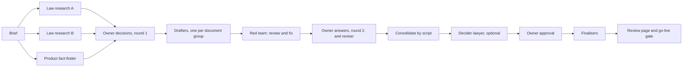

# AI Legal Team

A reusable skill and prompt kit that runs a **team of AI agents** to draft a complete legal pack for a
software product: Terms of Service, Privacy Policy, seller or business terms, a payments and refunds
policy, community guidelines, a prohibited-listings policy, an AI features notice, consent forms and an
internal data map.

What makes it different from "write me a privacy policy":

- **It checks the product first.** A fact-finder maps what the code really does (data, money, promises
  already made in the UI), so no document claims something the product does not do.
- **It researches the law from primary sources** for the jurisdiction you name, with a confidence level
  for every finding.
- **It argues with itself.** A red team attacks every draft for false claims, contradictions and clauses
  a court would strike, and fixes the clear-cut ones.
- **The owner decides.** Every business choice is put to the owner as a short question with a
  recommendation. An optional "decider lawyer" proposes answers to every open legal question for the
  owner to confirm.
- **It costs little to review.** A script (no AI) builds one readable review page from the Markdown files.

> **Not legal advice.** Everything this kit produces is a draft prepared by AI systems. Have a qualified
> lawyer in each jurisdiction review the final documents before you publish them.

## Who it is for

Founders, product teams and AI agents (Claude Code, Codex, Cursor, ChatGPT, or anything that can read
files and browse the web) that need a first-class legal pack grounded in their actual product and their
actual law, and a clear list of what to ask a real lawyer.

## What you get

| Output | For |
|---|---|
| Terms of Service, with category-specific sections | Everyone who uses the product |
| Privacy Policy | Everyone |
| Business (seller) Terms, with category schedules | People and companies who sell or list |
| Payments and Refunds policy | Buyers and sellers |
| Community Guidelines | Anyone who posts, reviews or messages |
| Prohibited and restricted listings policy | Sellers |
| AI Features Notice | Users of AI features |
| Consent texts (for example for regulated services) | Users who need them |
| Data map and retention schedule | Owner, lawyer, engineering (internal) |
| Questions for counsel | The owner's lawyer (internal) |
| Product changes needed | Engineering (internal) |
| Law research summary, red-team review, decider's answers | Owner and lawyer (internal) |
| One review page (HTML) | Reading and sharing the whole pack |

## How it works



The full playbook is in [`SKILL.md`](SKILL.md). Each role has its own prompt in [`roles/`](roles/).

## Quick start

**Claude Code.** Copy this folder to `~/.claude/skills/ai-legal-team` (all your projects) or to
`.claude/skills/ai-legal-team` inside a project. Then ask: *"Form an AI legal team for this product"*.

**Other agents.** Give your agent [`SKILL.md`](SKILL.md) as its instructions. Run each role in
[`roles/`](roles/) as a separate agent or chat, passing the filled-in templates from
[`templates/`](templates/).

**By hand.** Follow the phases in `SKILL.md` in one chat, one role at a time. It is slower, but it works.

### Requirements

- An agent that can read files and, for the research roles, search and open web pages.
- Read access to the product's code (or a written description of what it does, if there is no code).
- Python 3.8 or later with `pip install markdown`, to build the review page with `scripts/build_pack.py`.

### Try the build script

```
pip install markdown
python scripts/build_pack.py examples/demo-pack
```

This builds the fictional demo pack: `questions-for-counsel.md`, `app-changes-needed.md` and
`law-research.md` in its `drafts/` folder, and `review.html`, one page with every document and the markers
colour-coded. Use `--page-only` to rebuild just the page, and `--check-publish` before go-live (it fails
while any public document is still a draft or carries a marker). Settings go in the pack's `pack.json`;
see [`scripts/pack.example.json`](scripts/pack.example.json) and the notes at the top of the script.

## Folder layout

```
SKILL.md                 the playbook (start here)
roles/                   one prompt per team role
templates/               brief, owner answers, owner questions, document formats and contents
checklists/              jurisdiction research topics, go-live gate
scripts/build_pack.py    builds the consolidated documents and the review page (no AI)
scripts/pack.example.json
examples/demo-pack/      a tiny fictional pack showing the format (try the script on it)
```

## Lessons built in

This kit came out of a real run for a two-sided marketplace. Things it learned the hard way:

- Map the product before drafting. The first draft of almost every legal page promises things the code
  does not do.
- Put each owner decision to the owner as one plain question with a recommendation, and write the answer
  into one short "owner answers and law digest" file. Agents read that file instead of long memos.
- Save work as you go, and resume stopped agents instead of restarting them. Usage limits will interrupt
  long runs.
- Never paste large documents into rich-document tools through an AI. Build the review page with the
  script instead.
- Treat real bugs found along the way (money not refunded, sensitive data visible to the wrong people)
  as separate engineering tasks, not as wording problems.
- Do not publish the documents in the product until the product changes they depend on are live.

## License

MIT. See [`LICENSE`](LICENSE).
